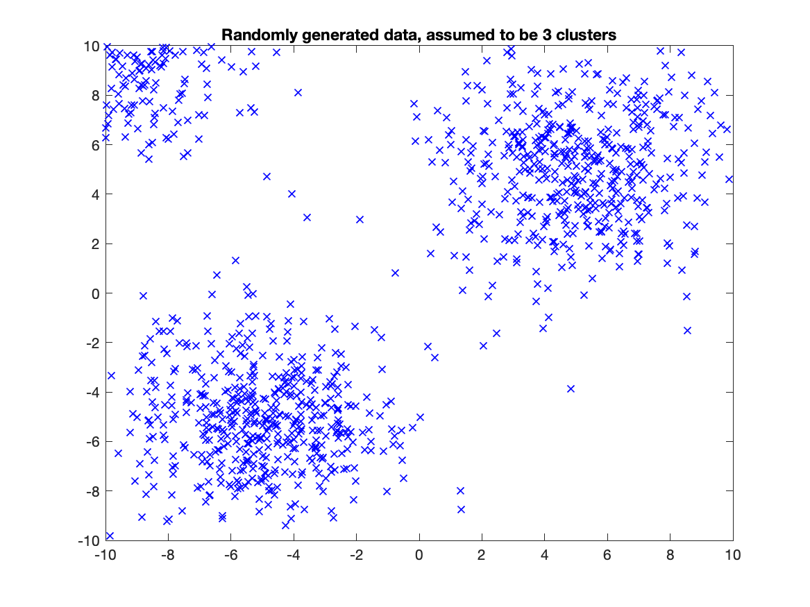
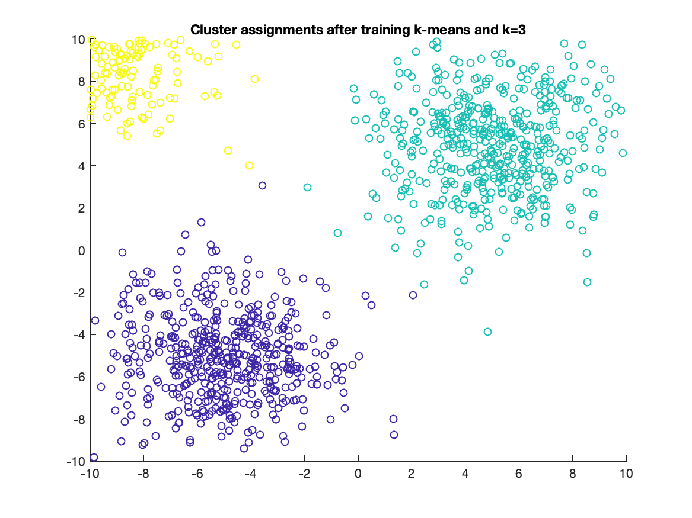
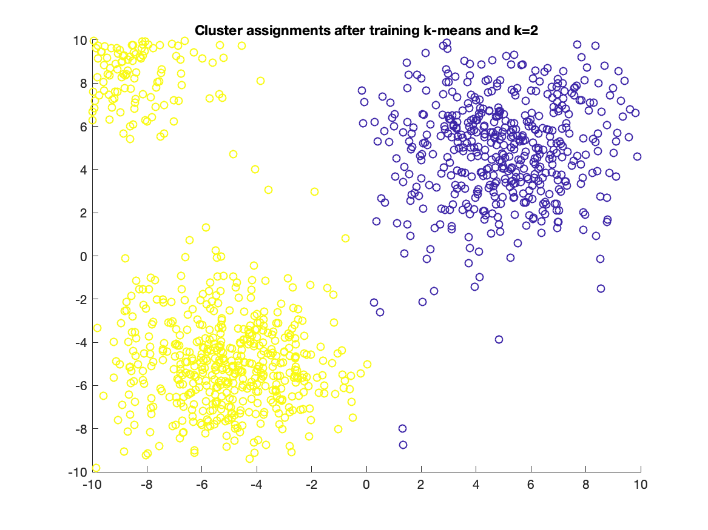
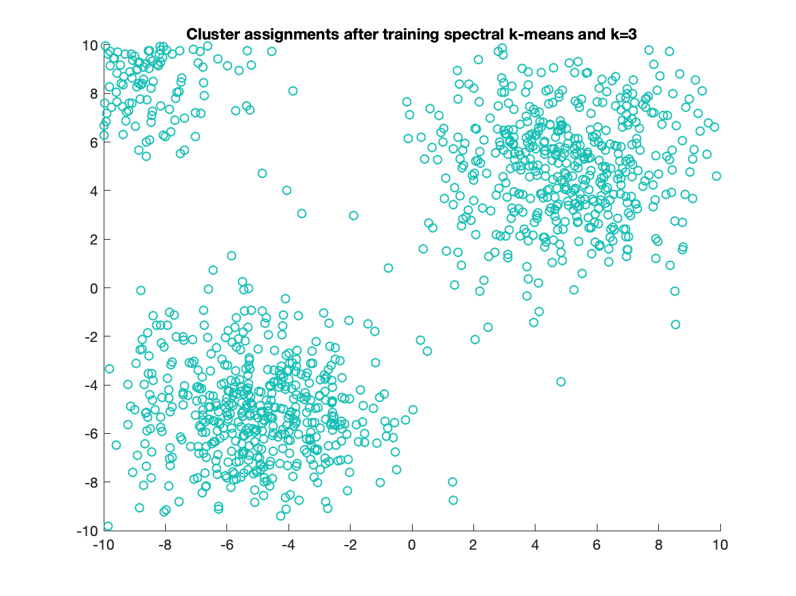
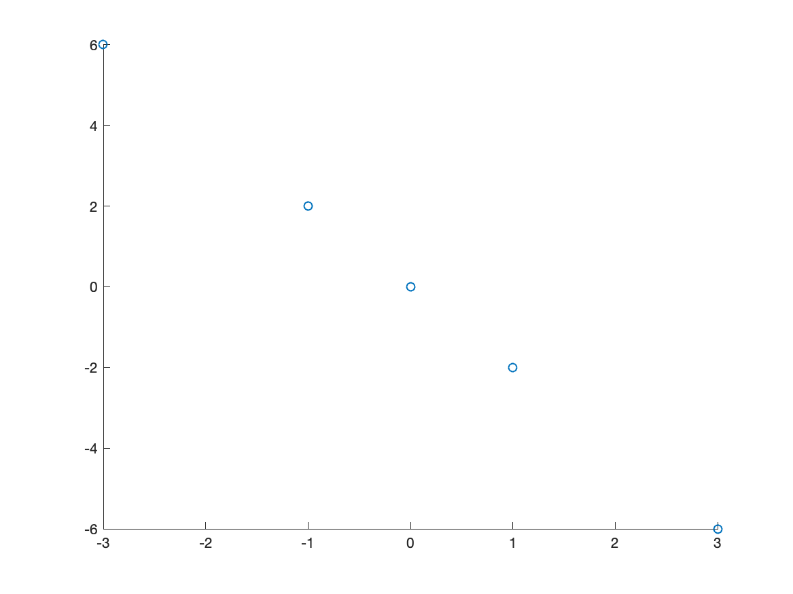

# CSE 847 - Homework 5

> Name: `Ibrahim Ahmed`
> NetID: `ahmedibr`


## Problem `1.1`

```
Elaborate the relationship between k-means and spectral relaxation of k-means. Is it possible that we obtain exact k-means solution using spectral relaxed k-means?
```

If the data supplied to k-means forms for example a circular shape, and there are 2 clusters with one being surrounded by the other, k-means falls apart because it will cluster both the inside points and outside points. Spectral k-means allows us to detect clusters that form complex shapes without having to separate our data.

Spectral k-means is just k-means with a pre-processing step that involves transforming the data using the eigenvectors. If the transformation results in the original dataset, the results from k-means and spectral k-means will be the same. Therefore, it is possible to obtain the exact same solution using spectral relaxed k-means and k-means.

## Problem `1.2`

The k-means implementation is included in the submission file and is named `k_means.m`. You can run the `problem_1_2.m` script to generate the figures below.

Here are the results from randomly generated data.

First, we'll plot the randomly generated data



As you can see, there are three clear clusters, one in the top right corner, one in the bottom left corner, and one in the top left corner.


After running k-means, here are the cluster assignments:



The k-means implementation did a sufficient job in detecting the three clusters.

In addition, I ran the clustering with k=2, and here was the result:



The results were as expected and the cluster assignments seem optimal.

Oddly enough, the relaxed spectral k-means clustered all of the points into a single cluster for the randomly generated dataset, as seen below:



## Problem `2.1`

Here is the plot of the points provided:



The first principal component is `[-0.4472, 0.8944]`. This was computed using matlabs built in `pca` function. This makes sense as the point aligns with the downward line formed by the points which is indicative of the direction of the points.

The second principal component is `[0.8944, 0.4472]`. This point is almost a mirror of the first point, but further along the line that is formed by the points.